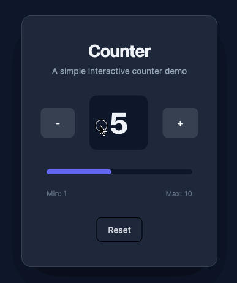

# Trellis

[](https://github.com/emmapowers/trellis/actions/workflows/ci.yml)
[](https://www.python.org/downloads/)
[](https://opensource.org/licenses/MIT)

Build complex web applications in Python—control panels, internal tools, data-intensive interfaces—without the frontend plumbing.

[Documentation](https://emmapowers.github.io/trellis/) · [Playground](https://emmapowers.github.io/trellis/playground/)

<p align="center">
  
</p>

## Table of Contents

- [What is Trellis?](#what-is-trellis)
- [Use Cases](#use-cases)
- [Features](#features)
- [Example](#example)
- [Installation](#installation)
- [Implementation Status](#implementation-status)
- [Development](#development)

## What is Trellis?

Trellis is a Python framework for building web applications. You write functions that describe what your UI should look like. The framework handles rendering, state management, and browser communication. When state changes, only affected components re-render—no manual wiring, no full-page refreshes. You work entirely in Python; there's no JavaScript to write, no templates, no REST API plumbing.

### Why another framework?

Dashboard frameworks like Streamlit and Gradio made Python UI development accessible—simple scripts become interactive apps in minutes. But they hit limits quickly. Performance degrades, state becomes tangled, and what started simple becomes painful to maintain.

Traditional web development—React frontend, REST API—scales well and produces maintainable code. But you spend a lot of time on plumbing that has nothing to do with your actual problem.

Trellis aims for both: simple to start, maintainable as applications grow.

## Use Cases

**Good for:**

- Instrument control applications—hardware interfaces, data capture, desktop deployment
- Internal tools and developer interfaces—remote access, rapid development
- Line-of-business apps—workflows, data entry, admin panels

**Not for:**

- Mobile apps or slow networks
- Marketing sites or static content
- High-traffic public applications (designed for tens/hundreds of users, not thousands)

## Features

- **Declarative UI in Python** — `@component` functions with context-manager syntax. No templates, no separate frontend language.
- **Reactive state** — Automatic dependency tracking. Components re-render when dependencies change.
- **Fine-grained updates** — Only affected components re-render. Efficient diffs over the wire.
- **Three platforms** — Server (web app), Desktop (native), Browser (Pyodide). Same codebase, each adapts to platform strengths.
- **Type-safe throughout** — Full type hints. IDE autocompletion works.
- **Widget toolkit** — Forms, data display, overlays, navigation. Full HTML support when you need lower-level control.
- **Routing** — Client-side navigation, URL-based routing.
- **Live reload** — File changes trigger rebuild. State preserved.

## Example

```python
from dataclasses import dataclass
from trellis import Stateful, component
from trellis import html as h
from trellis import widgets as w

@dataclass
class Counter(Stateful):
    count: int = 0
    def increment(self) -> None:
        self.count += 1

@component
def App() -> None:
    state = Counter()
    with w.Column():
        w.Label(text=f"Count: {state.count}", font_size=24)
        w.Button(text="Increment", on_click=state.increment)
```

## Installation

```bash
pip install git+https://github.com/emmapowers/trellis.git
```

For desktop app support, install with the desktop extra:

```bash
pip install "trellis[desktop] @ git+https://github.com/emmapowers/trellis.git"
```

## Implementation Status

> **Early development** — The API is unstable and may change significantly, including the widget framework.

**Status:** ✅ implemented · 🚧 partial · ❌ not yet

|     | Feature |
|-----|---------|
| ✅ | Core rendering and reconciliation |
| ✅ | Reactive state with dependency tracking |
| ✅ | Server platform |
| ✅ | Browser platform (Pyodide) |
| ✅ | Desktop platform (PyTauri) |
| ✅ | HTML elements |
| ✅ | Type safety |
| 🚧 | Widget toolkit (basics only) |
| ❌ | Partial updates (sends full tree) |
| ❌ | Bidirectional binding (`Mutable[T]`) |
| ❌ | Routing |
| ❌ | Live reload |

## Development

**Commands:**

```bash
pixi run demo             # Run the demo app (server)
pixi run demo --desktop   # Run the demo app (desktop)
pixi run test             # Run tests
pixi run lint             # Check linters
pixi run cleanup          # Format and lint with auto-fix
```

**Project structure:**

```text
src/trellis/
├── core/           # Rendering, state, reconciliation
├── html/           # HTML element components
├── widgets/        # Widget library
└── platforms/
    ├── server/     # FastAPI web server + WebSocket
    ├── desktop/    # PyTauri native desktop app
    └── common/     # Shared client code
```

See [docs/docs/design/](docs/docs/design/) for detailed design documents.
