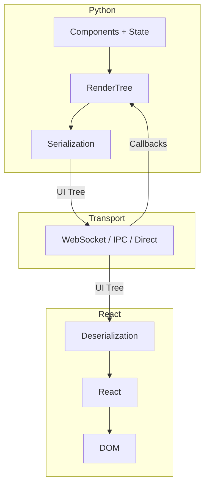
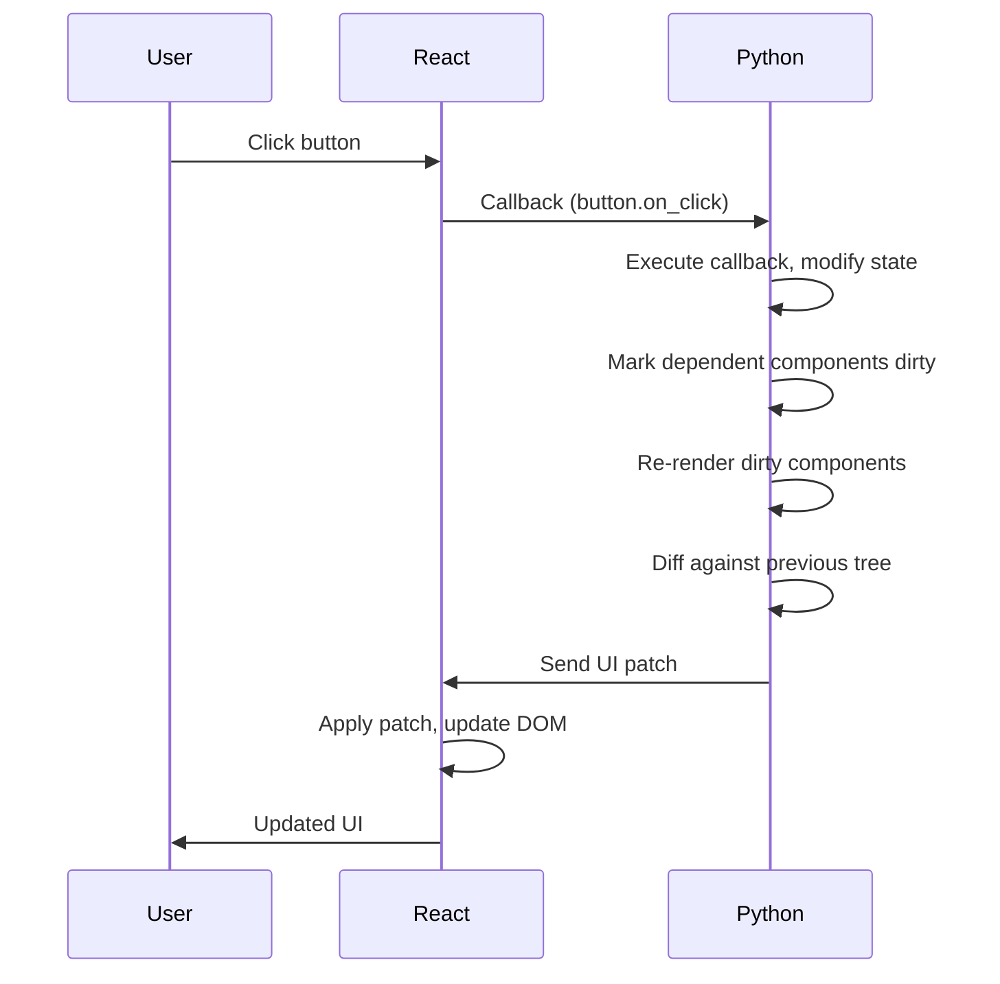

# Trellis Design Document

## Table of Contents

1. [Purpose](#purpose)
2. [Problem](#problem)
3. [Inspiration](#inspiration)
4. [Use Cases](#use-cases)
5. [Design Principles](#design-principles)
6. [Features](#features)
7. [Architecture](#architecture)
8. [Follow-up Documents](#follow-up-documents)

---

## Purpose

Trellis is a Python framework for building complex web applications—control panels, professional tools, data-intensive interfaces. Simple enough to not get in your way, but designed to stay performant and maintainable as applications grow large.

---

## Problem

There are several ways to build web applications in Python today, and none of them offer both a low barrier to entry and a high ceiling for complexity.

Traditional web development—server-rendered templates or a React frontend with a REST API—scales well and produces maintainable code. But you spend a lot of time on plumbing that has nothing to do with your actual problem. It's like building desktop UIs by manually painting pixels instead of using a widget toolkit. The floor is high, even if the ceiling is manageable.

Dashboard frameworks like Streamlit and Gradio made Python UI development accessible. Simple scripts become interactive apps in minutes. But they hit limits quickly—performance degrades, state becomes tangled, and what started simple becomes painful to maintain. The floor is low, but so is the ceiling.

Component-based frameworks like Panel and Solara improved on this model, bringing composable UIs and better reactivity. But their notebook heritage shows. They were designed for dashboards—exploring data, presenting charts—not for building applications with complex state and interaction patterns. When pushed beyond that, they break in ways that are hard to recover from.

Trellis is for building applications, not dashboards.

---

## Inspiration

Trellis draws from over twenty years of building UIs across C++ desktop applications, traditional web development, and Python frameworks.

**Qt** shaped my early understanding of what a well-designed UI framework looks like. I worked with Qt from 2004 to 2017. In the early 2000s, most C++ APIs were a nightmare to use. Qt stood out: a clear vision of what it was for, solid API design that put the developer first, and excellent documentation. The result was a widget toolkit that scaled, performed well, and let you manage complexity as applications grew large. That combination—scalable, performant, and complexity under control—is the bar Trellis aims to meet.

**React** was my introduction to declarative UI. Declarative UIs are dense—you can quickly see what's going on and understand the structure in a way that imperative UI code doesn't allow. The component model was equally impactful. Grouping your application into components felt natural, whereas in Qt you'd need to subclass widgets and wire things together manually. React also introduced me to explicit state management, particularly hooks. It made clear that state management deserves to be a first-class concern, not an afterthought.

**GraphQL and Apollo Client** showed me how to push updates from a server to a reactive web UI. Desktop frameworks handle this simply—an event happens, you call `widget.setText()`, done. In traditional React/REST applications, pushing updates from the server is not nearly so straightforward. Apollo Client's combination of subscriptions and client-side caching demonstrated how to maintain a live domain model on the client that updates automatically as data arrives.

**State management libraries** like Redux and MobX were valuable for exploring different approaches to the state problem and their tradeoffs. State management is one of the hardest parts of building UIs, and these libraries each tackled it differently.

**Jupyter widgets** was my first encounter with server-side interactive Python UIs. The imperative API was limiting, but it proved the concept.

**Reacton** brought React's ideas to the Jupyter world—declarative components and explicit state management, but in Python. It showed that the React model could translate, though the ipywidgets foundation imposed constraints.

**Panel** demonstrated the value of letting users bring the libraries they're already familiar with rather than forcing a single ecosystem.

---

## Use Cases

### Intended Use Cases

- **Instrument control applications** — More than just data visualization. The UI includes controlling data capture, debugging, instrument maintenance, and configuration. Desktop deployment support is important.
  - *Example: A desktop application for controlling a mass spectrometer. Large, complex UI distributed as a standalone app.*

- **Internal tools and developer interfaces** — Web applications deployed to internal systems for remote access. Rapid development tends to be more important than polished UX. Users may need access to the same resource (like a device), so managing shared state matters.
  - *Example: A web app deployed to a Linux system that lets developers interact with hardware remotely.*

- **Line-of-business applications** — Internal tools for managing workflows, data entry, reporting—the kinds of applications enterprises once built with Visual Basic or Access. Also internal SaaS dashboards and admin panels for team use, not customer-facing.

- **Products where the UI is necessary but incidental** — The product doesn't work without a UI, but nobody cares about it unless it's broken or truly awful. The UI isn't the product; it's how you access the product.
  - *Examples: Router admin panels, CI/CD pipeline dashboards, database management interfaces, hardware configuration tools.*

### Not Intended Use Cases

- **Mobile applications and slow networks** — Trellis assumes a modern desktop with a fast connection to the server. We're not optimizing for mobile screens, slow connections, or minimal bundle sizes.

- **Marketing sites and static content** — Trellis is for interactive applications. If your content doesn't change, use a static site generator.

- **Applications where UX polish is paramount** — When pixel-perfect design and fine-grained control over interactions matter most, the tradeoffs Trellis makes (server-side state, component-level updates) get in the way. Use a traditional frontend framework.

- **High-traffic public applications** — Trellis is not "web scale." The server-side state model doesn't scale horizontally the way stateless REST APIs do. It's designed for tens or hundreds of concurrent users, not thousands.

---

## Design Principles

- **Clean API** — The framework should fade into the background. When you read your code, you see your application logic, not the framework. It's about signal-to-noise ratio—not just reducing boilerplate, but ensuring the framework doesn't draw attention to itself.

- **Ergonomic API** — The patterns should feel natural to use. Once you learn the framework's conventions, you can work effectively without fighting it.

- **Hard to misuse** — The correct thing should be easy; mistakes should be hard. We implement this first through API design—if the wrong thing is hard to express, it's hard to do. Where that's not possible, we fall back to type safety, then runtime checks. No references to variables by string; the type checker and the framework catch errors before you do.

- **Complexity belongs in the framework** — It's okay for the implementation to be complex if it hides complexity from the user. The framework should do the hard work so your application code doesn't have to. But this is a responsibility—hiding complexity is only useful if it stays hidden.

- **Explicit at the edges** — Abstractions always leak eventually. When they do, fail gracefully by making it visible. `Mutable` exists because bidirectional state behaves differently—rather than hide it behind a uniform API and let users discover the problem, we surface it explicitly.

- **Declarative UI** — Describe what the UI should look like, not how to build it. The structure should be visible in the code. Building UIs from components should feel natural—group related UI and behavior together without ceremony.

- **State is a first-class problem** — State management is one of the hardest parts of UI development. It deserves dedicated attention, not an afterthought.

---

## Features

- **Declarative UI in Python** — Define UI as functions of state using `@component`. Hierarchical nesting with context-manager syntax. No templates, no separate frontend language.

- **Reactive state** — Automatic dependency tracking. Components re-render when their dependencies change—no manual subscriptions or explicit wiring.

- **Fine-grained updates** — Only affected components re-render. Efficient diffs transmitted over the wire. Scales to large, complex UIs.

- **Three platforms** — Same codebase runs as a web app (Server), native desktop app (Desktop), or entirely in-browser (Browser). Each adapts to platform strengths and constraints.

- **Type-safe throughout** — Full type hints from Python to TypeScript. Catch errors at typecheck time. IDE autocompletion works.

- **Desktop-first widget set** — Comprehensive components for forms, data display, overlays, and navigation. Full HTML support when you need lower-level control.

### UI

- **Declarative components** — Define UI as functions of state using `@component` decorator.
  - Context-manager syntax for hierarchical nesting
  - Props and children support

- **Widget toolkit** — Desktop-first widget set.
  - Comprehensive form inputs (text, numeric, select, date/time)
  - Data display (tables, trees, cards)
  - Overlays (dialogs, popovers, tooltips)
  - Navigation and layout components

- **Full HTML support** — Native HTML elements with typed DOM events.
  - Type-safe event handlers
  - Attribute and style support

- **CSS styling system** — Comprehensive styling options.
  - Inline styles
  - CSS classes

- **Routing** — Client-side navigation in react-router style.
  - URL-based routing
  - Multi-page applications

### State

- **Reactive state** — Automatic dependency tracking.
  - Components re-render when their dependencies change
  - No manual subscriptions or explicit wiring

- **Fine-grained updates** — Only affected components re-render.
  - No full-tree reconciliation
  - Efficient for large, complex UIs

- **Bidirectional binding** — `Mutable[T]` for two-way state.
  - Server state syncs with UI inputs
  - Explicit marker for where state flows both directions

- **Mutable data type wrappers** — Reactive wrappers for standard Python collections.
  - Lists, dicts, sets with change tracking

- **Context** — Share state down the component tree.
  - Context-manager syntax for providing state
  - `from_context()` for consuming

### Rendering

- **Batched updates** — Changes batched at 30fps.
  - Multiple state changes coalesce into single update
  - Renders skipped if nothing dirty

- **Efficient diffs** — Only changed portions transmitted.
  - Minimal data over WebSocket
  - Patch-based updates

- **Client-side DOM updates** — React handles browser rendering.
  - Virtual DOM diffing
  - Minimal actual DOM manipulation

### Platforms

Trellis applications can run on three platforms. A single codebase can target multiple platforms, with the framework adapting to each platform's strengths and constraints.

- **Server** — Web application with Python backend.
  - Python runs on server, browser renders UI
  - WebSocket connection for live updates
  - *Capabilities:* Multi-user sessions, external I/O (databases, APIs, hardware), custom HTTP routes
  - *Limitations:* Requires network connection, server infrastructure

- **Desktop** — Native application with embedded Python.
  - Python runs in native process, system webview renders UI
  - IPC communication with webview for low latency
  - *Capabilities:* Native window management, system tray, menus, file system access, native dialogs, offline operation, single-file distribution
  - *Limitations:* Requires installation, platform-specific builds

- **Browser** — Runs entirely in browser via WebAssembly.
  - Python runs in browser (Pyodide), same browser renders UI
  - No server required
  - *Capabilities:* Shareable via URL, no installation, works offline, instant deployment
  - *Limitations:* No filesystem I/O, no external network (without CORS), constrained compute, larger initial download

### Developer Experience

- **Live reload** — File changes trigger rebuild and refresh.
  - Server-side state preserved
  - Fast iteration

- **Type safety** — Full type hints throughout.
  - Catch errors at typecheck time
  - IDE autocompletion and documentation

- **Bundle generation** — Dev and release builds.
  - Development builds for iteration
  - Optimized release builds

- **Playwright testing** — End-to-end test support.
  - Browser automation
  - Python test integration

---

## Architecture

Trellis splits work between Python and React. Python owns application state and defines the UI as a tree of components. React renders that tree to the DOM and captures user interactions. The two communicate through a transport layer that varies by environment—WebSocket for Server mode, IPC for Desktop, or direct calls for Browser mode.

### Core Concepts

**Components produce a tree.** Python functions decorated with `@component` describe what the UI should look like. When executed, they produce a tree of `Element` objects—a complete description of the current UI state.

**RenderSession manages the lifecycle.** The RenderSession orchestrates rendering, tracks which components need to re-render, reconciles changes when the tree updates, and maintains per-component state. It's the central coordinator between your components and the React client.

**Reactive state drives updates.** State objects automatically track which components read them. When state changes, dependent components are marked dirty and re-render on the next frame. You modify state; the framework figures out what to update.

**React renders the UI.** The Element tree is serialized and sent to React, which renders it to the DOM. React handles the actual browser interaction—event listeners, DOM updates, accessibility.

**Callbacks close the loop.** User interactions trigger callbacks that execute Python functions. Those functions modify state, which marks components dirty, which triggers re-renders, which sends updates back to React.

### Overview

### Interaction Flow

---

## Follow-up Documents

The following design documents cover specific areas in detail:

1. **[UI and Rendering](./ui-rendering)** — Declarative UI, rendering pipeline, efficient updates, custom components, callbacks (excluding state)

2. **[State](./state)** — State storage, fine-grained updates, context management, mutable wrappers

3. **[Platforms](./platforms)** — Platform architecture, message protocol, server platform (WebSocket), desktop platform (PyTauri), platform selection

4. **[Security](./security)** — XSS prevention, WebSocket security, callback validation, state isolation, session security, CSRF, input validation, deserialization safety, native API exposure (desktop), sandboxing (playground)

5. **[HTML Components](./html-components)** — UI elements mirroring HTML tags

6. **[CSS APIs](./css)** — CSS builder API

7. **[Widgets](./widgets)** — Blueprint implementation

8. **[Imperative API](./imperative-api)** — Events, refs, and imperative DOM operations

9. **[Router](./router)** — Implementing the router pattern

10. **[Playground](./playground)** — How the Trellis playground works, Pyodide integration, JSFiddle-style experience

11. **[Hot Reload](./hot-reload)** — File watching, rebuild, state preservation
