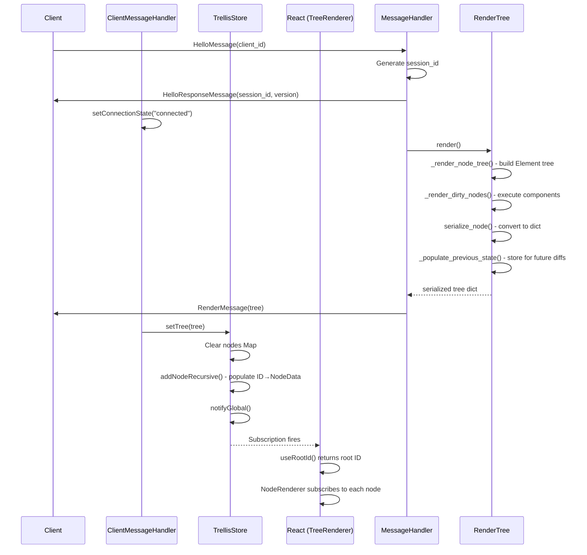
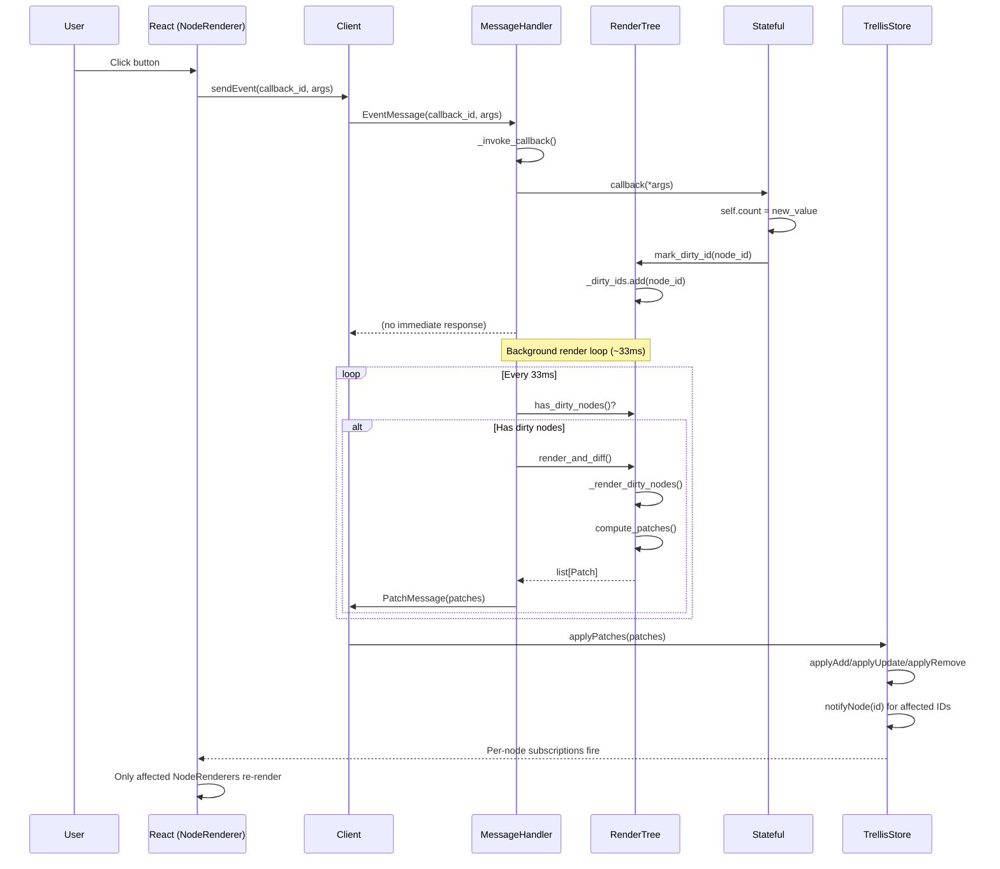
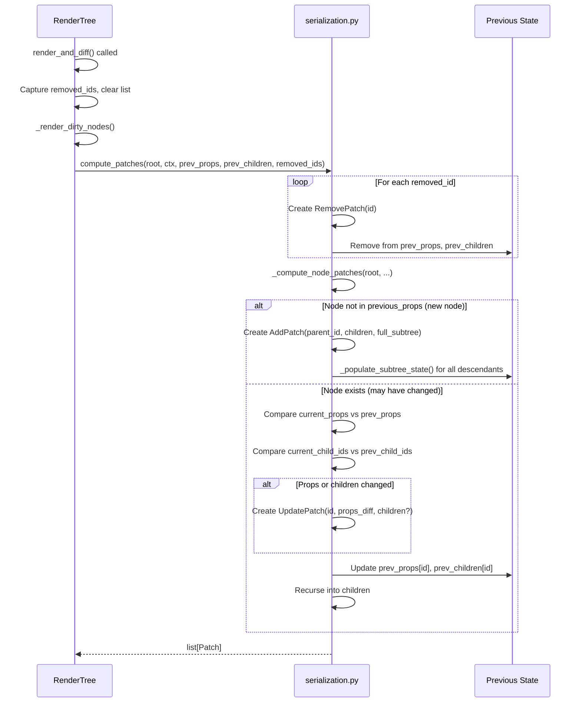
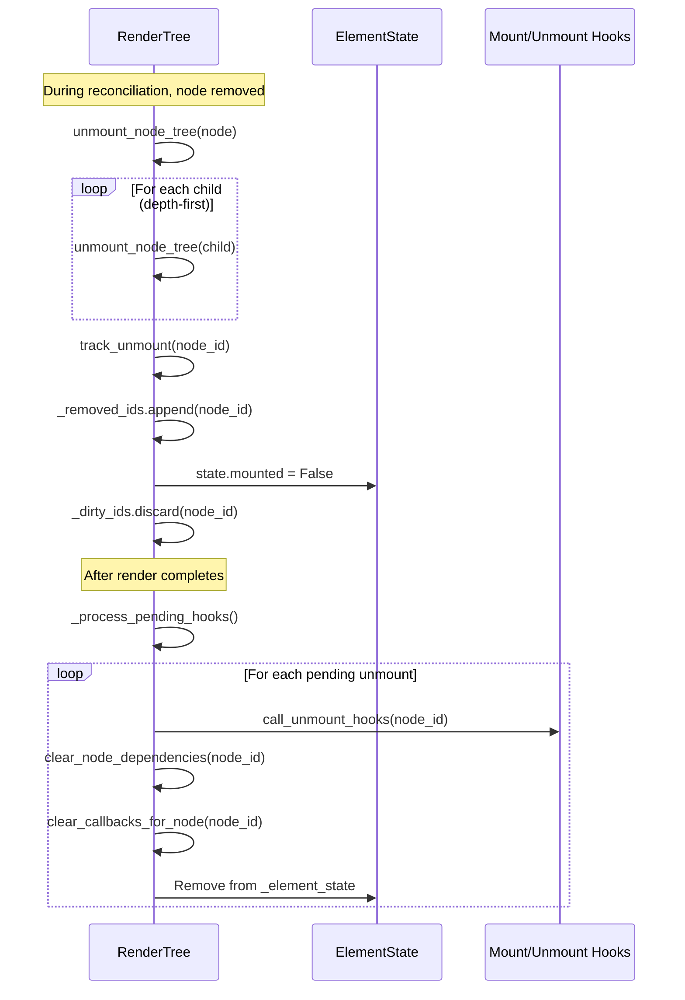
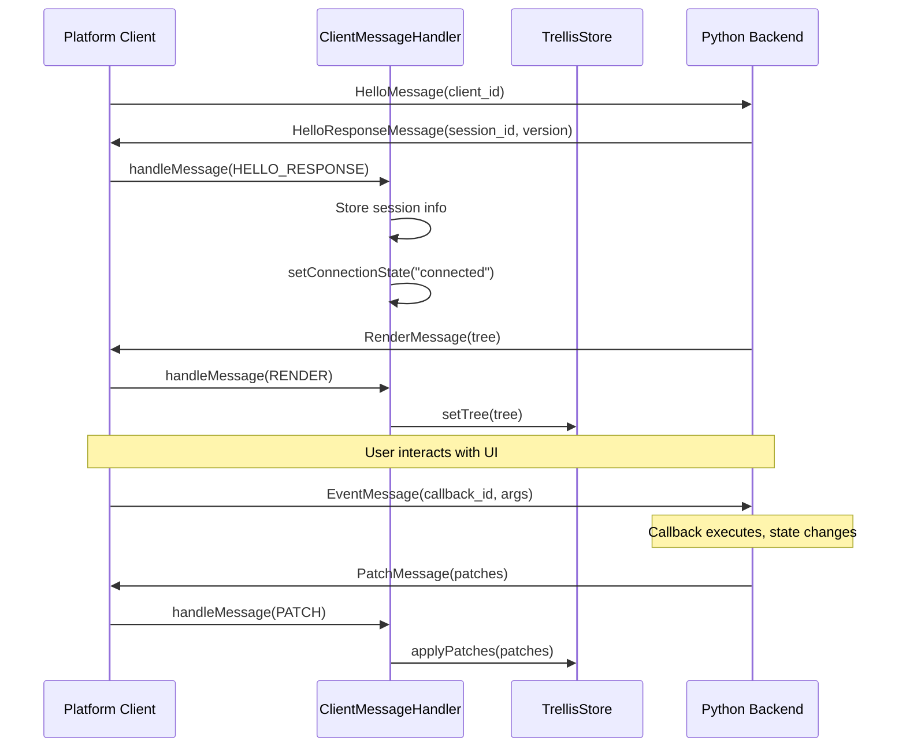

# Trellis Diffing and Batching Architecture

## Overview

The batching and diffing system enables incremental UI updates without re-rendering the entire tree. Updates are batched at 30fps and only changed nodes are sent to the client via patches.

## Architecture Diagram

```
┌─────────────────────────────────────────────────────────────────────────────────┐
│                              SERVER (Python)                                     │
│                                                                                  │
│  ┌─────────────────────────────────────────────────────────────────────────┐    │
│  │                           RenderTree                                     │    │
│  │                        (rendering.py)                                    │    │
│  │  ┌─────────────────────────────────────────────────────────────────┐   │    │
│  │  │  State Tracking:                                                 │   │    │
│  │  │  • _dirty_ids: set[str]         # Nodes needing re-render       │   │    │
│  │  │  • _previous_props: dict        # Last serialized props         │   │    │
│  │  │  • _previous_children: dict     # Last child ID lists           │   │    │
│  │  │  • _removed_ids: list[str]      # Unmounted node IDs            │   │    │
│  │  └─────────────────────────────────────────────────────────────────┘   │    │
│  │                                                                         │    │
│  │  Key Methods:                                                           │    │
│  │  • render() → dict          # Initial: full tree serialization         │    │
│  │  • render_and_diff() → list[Patch]  # Incremental: patches only        │    │
│  │  • has_dirty_nodes() → bool                                            │    │
│  │  • mark_dirty_id(node_id)   # Called when Stateful props change        │    │
│  └─────────────────────────────────────────────────────────────────────────┘    │
│                                         │                                        │
│                                         ▼                                        │
│  ┌─────────────────────────────────────────────────────────────────────────┐    │
│  │                        serialization.py                                  │    │
│  │                                                                         │    │
│  │  • serialize_node(node, ctx) → dict       # Full tree for RenderMessage │    │
│  │  • compute_patches(root, ctx, prev_props, prev_children, removed_ids)   │    │
│  │      → list[Patch]                                                      │    │
│  │                                                                         │    │
│  │  Patch Types (messages.py):                                             │    │
│  │  ┌───────────────────┬───────────────────┬────────────────────────┐    │    │
│  │  │ AddPatch          │ UpdatePatch       │ RemovePatch            │    │    │
│  │  │ • parent_id       │ • id              │ • id                   │    │    │
│  │  │ • children[]      │ • props?          │                        │    │    │
│  │  │ • node (full)     │ • children?       │                        │    │    │
│  │  └───────────────────┴───────────────────┴────────────────────────┘    │    │
│  └─────────────────────────────────────────────────────────────────────────┘    │
│                                         │                                        │
│                                         ▼                                        │
│  ┌─────────────────────────────────────────────────────────────────────────┐    │
│  │                      MessageHandler                                      │    │
│  │                    (message_handler.py)                                  │    │
│  │                                                                         │    │
│  │  Batched Render Loop (_render_loop):                                    │    │
│  │  ┌─────────────────────────────────────────────────────────────────┐   │    │
│  │  │  while True:                                                     │   │    │
│  │  │      await asyncio.sleep(batch_delay)  # ~33ms (30fps)          │   │    │
│  │  │      if tree.has_dirty_nodes():                                 │   │    │
│  │  │          patches = tree.render_and_diff()                       │   │    │
│  │  │          if patches:                                            │   │    │
│  │  │              await send_message(PatchMessage(patches))          │   │    │
│  │  └─────────────────────────────────────────────────────────────────┘   │    │
│  │                                                                         │    │
│  │  Message Flow:                                                          │    │
│  │  • run(): hello → initial_render (RenderMessage) → event loop          │    │
│  │  • handle_message(EventMessage): invoke callback → mark nodes dirty    │    │
│  └─────────────────────────────────────────────────────────────────────────┘    │
│                                         │                                        │
│                                         ▼                                        │
│  ┌─────────────────────────────────────────────────────────────────────────┐    │
│  │                Platform Handlers (transport only)                        │    │
│  │                                                                         │    │
│  │  WebSocketMessageHandler   BrowserMessageHandler   DesktopMessageHandler│    │
│  │  (server/handler.py)       (browser/handler.py)    (desktop/handler.py) │    │
│  │                                                                         │    │
│  │  Only implement: send_message() / receive_message()                     │    │
│  └─────────────────────────────────────────────────────────────────────────┘    │
│                                         │                                        │
└─────────────────────────────────────────│────────────────────────────────────────┘
                                          │
                    WebSocket/PostMessage │ (msgpack encoded)
                                          │
                                          ▼
┌─────────────────────────────────────────────────────────────────────────────────┐
│                              CLIENT (TypeScript)                                 │
│                                                                                  │
│  ┌─────────────────────────────────────────────────────────────────────────┐    │
│  │                Platform Clients (transport only)                         │    │
│  │                                                                         │    │
│  │  ServerTrellisClient    BrowserTrellisClient    DesktopTrellisClient   │    │
│  │  (server/.../           (browser/.../           (desktop/.../           │    │
│  │   TrellisClient.ts)      BrowserClient.ts)       DesktopClient.ts)     │    │
│  │                                                                         │    │
│  │  Delegates message handling to ClientMessageHandler                     │    │
│  └─────────────────────────────────────────────────────────────────────────┘    │
│                                         │                                        │
│                                         ▼                                        │
│  ┌─────────────────────────────────────────────────────────────────────────┐    │
│  │                    ClientMessageHandler                                  │    │
│  │                  (ClientMessageHandler.ts)                               │    │
│  │                                                                         │    │
│  │  handleMessage(msg):                                                    │    │
│  │  ┌─────────────────────────────────────────────────────────────────┐   │    │
│  │  │  case RENDER:     store.setTree(msg.tree)                       │   │    │
│  │  │  case PATCH:      store.applyPatches(msg.patches)               │   │    │
│  │  │  case ERROR:      callbacks.onError(...)                        │   │    │
│  │  └─────────────────────────────────────────────────────────────────┘   │    │
│  └─────────────────────────────────────────────────────────────────────────┘    │
│                                         │                                        │
│                                         ▼                                        │
│  ┌─────────────────────────────────────────────────────────────────────────┐    │
│  │                        TrellisStore                                      │    │
│  │                      (core/store.ts)                                     │    │
│  │                                                                         │    │
│  │  Data Structure:                                                        │    │
│  │  • nodes: Map<string, NodeData>    # ID-keyed node storage             │    │
│  │  • nodeListeners: Map<string, Set<() => void>>  # Per-node subscribers │    │
│  │  • rootId: string | null                                                │    │
│  │                                                                         │    │
│  │  Key Methods:                                                           │    │
│  │  • setTree(root)        # Full tree (clears & rebuilds)                │    │
│  │  • applyPatches(patches)  # Incremental updates                        │    │
│  │      ├── applyAdd(patch)    # Add subtree, update parent.childIds     │    │
│  │      ├── applyUpdate(patch) # Merge props diff, update childIds       │    │
│  │      └── applyRemove(patch) # Remove node & descendants recursively   │    │
│  │                                                                         │    │
│  │  React Integration:                                                     │    │
│  │  • subscribeToNode(id, listener) # Per-node subscriptions              │    │
│  │  • notifyNode(id)                # Only affected nodes re-render       │    │
│  └─────────────────────────────────────────────────────────────────────────┘    │
│                                         │                                        │
│                                         ▼                                        │
│  ┌─────────────────────────────────────────────────────────────────────────┐    │
│  │                      React Components                                    │    │
│  │                                                                         │    │
│  │  ┌─────────────────┐    ┌──────────────────────────────────────────┐   │    │
│  │  │  TrellisRoot    │    │  TreeRenderer / NodeRenderer              │   │    │
│  │  │                 │    │  (TreeRenderer.tsx)                       │   │    │
│  │  │  Provides:      │    │                                          │   │    │
│  │  │  • TrellisContext│   │  const node = useNode(id);  ◄─── Only    │   │    │
│  │  │  • Connection   │    │  // Re-renders only when THIS node       │   │    │
│  │  │    status       │    │  // changes via store subscription       │   │    │
│  │  └─────────────────┘    └──────────────────────────────────────────┘   │    │
│  │                                                                         │    │
│  │  React Hooks (core/store.ts):                                           │    │
│  │  • useNode(id) → NodeData    # useSyncExternalStore + subscribeToNode  │    │
│  │  • useRootId() → string      # useSyncExternalStore + subscribeGlobal  │    │
│  └─────────────────────────────────────────────────────────────────────────┘    │
│                                                                                  │
└──────────────────────────────────────────────────────────────────────────────────┘
```

## Sequence Diagrams

### Initial Connection and Render



### Incremental Update (User Interaction)



### Patch Computation Flow



### Node Unmounting Flow



## Data Flow Summary

### Initial Render
1. Client connects → HelloMessage
2. Server responds → HelloResponseMessage
3. Server calls tree.render() → full serialized tree
4. Server sends → RenderMessage(tree)
5. Client: store.setTree(tree)
6. Client: React renders via TreeRenderer

### Incremental Update (State Change)
1. User action → EventMessage(callback_id, args)
2. Server: callback invoked → Stateful props mutate
3. Server: Stateful.__setattr__ → mark_dirty_id(node_id)
4. Server: render loop (every ~33ms):
   - Check has_dirty_nodes()
   - Call render_and_diff()
   - Compare current vs _previous_props/_previous_children
   - Generate patches (add/update/remove)
   - Update _previous_* state
   - Send PatchMessage(patches)
5. Client: store.applyPatches(patches)
6. Client: notifyNode(id) for affected nodes
7. Client: Only those NodeRenderers re-render via useSyncExternalStore

## Key Files Summary

### Server Side (Python)

| File | Key Exports | Role |
|------|-------------|------|
| `core/messages.py` | `Patch`, `AddPatch`, `UpdatePatch`, `RemovePatch`, `PatchMessage`, `RenderMessage` | Message/patch type definitions |
| `core/rendering.py` | `RenderTree`, `Element`, `ElementState` | Tree management, dirty tracking, render orchestration |
| `core/serialization.py` | `serialize_node()`, `compute_patches()` | Full serialization and incremental diff computation |
| `core/message_handler.py` | `MessageHandler` | Batched render loop (30fps), message protocol |
| `platforms/*/handler.py` | Platform-specific handlers | Transport only (WebSocket/PostMessage) |

### Client Side (TypeScript)

| File | Key Exports | Role |
|------|-------------|------|
| `common/client/src/types.ts` | `Patch`, `PatchMessage`, `RenderMessage`, etc. | Message type definitions (mirrors Python) |
| `common/client/src/ClientMessageHandler.ts` | `ClientMessageHandler` | Routes messages to store (RENDER/PATCH) |
| `common/client/src/core/store.ts` | `TrellisStore`, `useNode()`, `useRootId()` | ID-keyed state, patch application, React hooks |
| `common/client/src/TreeRenderer.tsx` | `TreeRenderer`, `NodeRenderer` | React rendering with per-node subscriptions |
| `common/client/src/TrellisRoot.tsx` | `TrellisRoot` | Top-level React component |
| `platforms/*/client/src/*.ts` | Platform clients | Transport only |

## Patch Types

| Patch | When Used | Client Action |
|-------|-----------|---------------|
| `AddPatch` | New node mounted | Add full subtree to store, update parent.childIds |
| `UpdatePatch` | Props or children order changed | Merge props diff (null = remove), update childIds |
| `RemovePatch` | Node unmounted | Recursively delete node and descendants |

## Key Design Decisions

1. **Server-side diffing**: The server maintains `_previous_props` and `_previous_children` and computes diffs. The client only applies patches.

2. **ID-keyed store**: Client uses `Map<string, NodeData>` instead of nested tree. This enables O(1) lookups and surgical updates.

3. **Per-node subscriptions**: Each `NodeRenderer` subscribes only to its own node via `useNode(id)`. When a patch arrives, only affected nodes re-render.

4. **Batched at 30fps**: Updates are coalesced in a background render loop. Multiple rapid state changes result in a single patch message.

5. **Transport/protocol separation**: Platform handlers only implement `send_message`/`receive_message`. All protocol logic lives in `MessageHandler` (server) and `ClientMessageHandler` (client).

## Client Platform Architecture

The client architecture separates transport concerns from protocol handling, enabling code reuse across three platforms: Server (WebSocket), Desktop (PyTauri Channel), and Browser (Web Worker/Pyodide).

### Architecture Diagram

```
┌─────────────────────────────────────────────────────────────────────────────────┐
│                         PLATFORM CLIENTS (Transport Layer)                       │
│                                                                                  │
│  ┌────────────────────┐ ┌────────────────────┐ ┌────────────────────────────┐   │
│  │ ServerTrellisClient│ │   DesktopClient    │ │      BrowserClient         │   │
│  │ (TrellisClient.ts) │ │ (DesktopClient.ts) │ │    (BrowserClient.ts)      │   │
│  ├────────────────────┤ ├────────────────────┤ ├────────────────────────────┤   │
│  │ Transport:         │ │ Transport:         │ │ Transport:                 │   │
│  │ • WebSocket        │ │ • PyTauri Channel  │ │ • Web Worker postMessage   │   │
│  │ • ws://host/ws     │ │ • pyInvoke()       │ │ • sendCallback()           │   │
│  ├────────────────────┤ ├────────────────────┤ ├────────────────────────────┤   │
│  │ Methods:           │ │ Methods:           │ │ Methods:                   │   │
│  │ • connect()        │ │ • connect()        │ │ • setSendCallback()        │   │
│  │ • sendEvent()      │ │ • sendEvent()      │ │ • sendHello()              │   │
│  │ • disconnect()     │ │ • disconnect()     │ │ • sendEvent()              │   │
│  └─────────┬──────────┘ └─────────┬──────────┘ └──────────────┬─────────────┘   │
│            │                      │                           │                  │
│            └──────────────────────┼───────────────────────────┘                  │
│                                   │                                              │
│                                   ▼                                              │
│  ┌─────────────────────────────────────────────────────────────────────────┐    │
│  │                      ClientMessageHandler                                │    │
│  │                   (ClientMessageHandler.ts)                              │    │
│  │                                                                          │    │
│  │  Shared Protocol Logic:                                                  │    │
│  │  ┌────────────────────────────────────────────────────────────────────┐ │    │
│  │  │ handleMessage(msg):                                                 │ │    │
│  │  │   HELLO_RESPONSE → store session_id, set "connected"               │ │    │
│  │  │   RENDER         → store.setTree(msg.tree)                         │ │    │
│  │  │   PATCH          → store.applyPatches(msg.patches)                 │ │    │
│  │  │   ERROR          → callbacks.onError(...)                          │ │    │
│  │  └────────────────────────────────────────────────────────────────────┘ │    │
│  │                                                                          │    │
│  │  State:                                                                  │    │
│  │  • connectionState: "disconnected" | "connecting" | "connected"         │    │
│  │  • sessionId, serverVersion                                             │    │
│  └──────────────────────────────────────────────────────────────────────────┘    │
│                                   │                                              │
│                                   ▼                                              │
│  ┌─────────────────────────────────────────────────────────────────────────┐    │
│  │                          TrellisStore                                    │    │
│  │                        (core/store.ts)                                   │    │
│  │                                                                          │    │
│  │  ID-Keyed State:                       React Hooks:                      │    │
│  │  • nodes: Map<string, NodeData>        • useNode(id) → NodeData         │    │
│  │  • nodeListeners: Map<id, Set<fn>>     • useRootId() → string           │    │
│  │  • rootId: string | null                                                 │    │
│  └──────────────────────────────────────────────────────────────────────────┘    │
│                                   │                                              │
│                                   ▼                                              │
│  ┌─────────────────────────────────────────────────────────────────────────┐    │
│  │                   React Components Layer                                 │    │
│  │                                                                          │    │
│  │  ┌─────────────────────┐    ┌───────────────────────────────────────┐   │    │
│  │  │    TrellisRoot      │    │        TreeRenderer                    │   │    │
│  │  │  (TrellisRoot.tsx)  │    │     (TreeRenderer.tsx)                 │   │    │
│  │  │                     │    │                                        │   │    │
│  │  │  • TrellisContext   │    │  NodeRenderer (React.memo):            │   │    │
│  │  │  • Connection status│    │  • useNode(id) for per-node sub       │   │    │
│  │  │  • Error display    │    │  • processProps() for callbacks       │   │    │
│  │  └─────────────────────┘    │  • Recursive child rendering          │   │    │
│  │                             └───────────────────────────────────────┘   │    │
│  └──────────────────────────────────────────────────────────────────────────┘    │
│                                                                                  │
└──────────────────────────────────────────────────────────────────────────────────┘
```

### Platform Client Interface

All platform clients implement the `TrellisClient` interface:

```typescript
interface TrellisClient {
  sendEvent(callbackId: string, args?: unknown[]): void;
  getConnectionState(): ConnectionState;
  getSessionId(): string | null;
  getServerVersion(): string | null;
}
```

### Transport Differences

| Platform | Transport | Connect Flow | Send Method |
|----------|-----------|--------------|-------------|
| Server | WebSocket | `new WebSocket(url)` | `ws.send(msgpack)` |
| Desktop | PyTauri Channel | `pyInvoke("trellis_connect")` | `pyInvoke("trellis_send")` |
| Browser | Web Worker | `setSendCallback(worker.postMessage)` | `sendCallback(msg)` |

### Message Protocol Sequence (All Platforms)



### Shared vs Platform-Specific Code

**Shared (common/client/src/)**:
- `ClientMessageHandler.ts` - Protocol handling
- `TrellisStore` / `store.ts` - ID-keyed state management
- `TrellisRoot.tsx` - Root React component (used by server/desktop)
- `TreeRenderer.tsx` - Node rendering with subscriptions
- `types.ts` - Message type definitions
- `TrellisClient.ts` - Client interface

**Platform-Specific**:
- `server/client/src/TrellisClient.ts` - WebSocket transport
- `desktop/client/src/DesktopClient.ts` - PyTauri Channel transport
- `browser/client/src/BrowserClient.ts` - Web Worker transport
- `browser/client/src/TrellisApp.tsx` - Browser-specific root (Pyodide lifecycle)

---

## Design Exploration: Inline Patch Generation

### Problem Statement

The current implementation has two passes:
1. **Reconcile/Execute**: Process dirty nodes, build updated tree
2. **Diff**: Walk tree again comparing to `_previous_props`/`_previous_children` to generate patches

During reconciliation, we already know which nodes are new/changed/removed—the second pass re-discovers this information.

### Proposed Solution: Single-Pass with Separated Concerns

Generate patches during reconciliation, but with cleaner separation between the reconciler and renderer.

### Current Design (Mixed Concerns)

The reconciler currently calls side effects directly:

```python
def reconcile_node_children(old_children, new_children, parent_id, tree):
    for new_child, old_child in pairs:
        if old_child:
            result = reconcile_node(old_child, new_child, parent_id, tree)
        else:
            result = tree.mount_new_node(new_child, parent_id)  # Side effect!

    for unmatched in old_children:
        tree.unmount_node_tree(unmatched)  # Side effect!
```

The reconciler is both discovering changes AND executing responses (mount, unmount, mark dirty).

### Proposed Design: Reconciler Returns Data, Renderer Acts

**Reconciler** — pure function, returns structured diff:

```python
@dataclass
class ReconcileResult:
    matched_unchanged: list[Element]                    # Same props, keep as-is
    matched_changed: list[tuple[Element, Element]]  # (old, new_descriptor), props differ
    added: list[Element]                                # New descriptors needing execution
    removed: list[Element]                              # Old nodes to cleanup
    children_order: list[str | Literal["new"]]              # Final order template

def reconcile_children(old_children, new_descriptors) -> ReconcileResult:
    """Pure matching logic - no side effects, no RenderTree access."""
    ...
```

**Renderer** — orchestrates execution, state, and patches:

```python
def process_reconcile_result(self, result: ReconcileResult, parent_id: str):
    patches = []

    # 1. Removals first (cleanup before new state)
    for node in result.removed:
        patches.append(RemovePatch(id=node.id))
        self._cleanup_state(node)

    # 2. Execute new subtrees
    executed_new = []
    for descriptor in result.added:
        executed = self._execute_subtree(descriptor, parent_id)
        executed_new.append(executed)

    # 3. Handle matched nodes with prop changes
    for old_node, new_descriptor in result.matched_changed:
        # Either mark dirty for later, or execute now and emit UpdatePatch
        self._handle_prop_change(old_node, new_descriptor)

    # 4. Build final children list and emit AddPatches
    children_ids = self._build_children_list(result, executed_new)
    for executed in executed_new:
        patches.append(AddPatch(
            parent_id=parent_id,
            children=children_ids,
            node=serialize_node(executed, self),
        ))

    return patches
```

### Execute Subtree for New Nodes

New nodes execute immediately (not deferred via dirty marking) since they have no prior state:

```python
def _execute_subtree(self, descriptor: Element, parent_id: str) -> Element:
    """Execute a new node and all descendants, returning fully built subtree."""
    node_id = self.next_element_id()
    node = dataclass_replace(descriptor, id=node_id)
    self._element_state[node_id] = ElementState(parent_id=parent_id, mounted=True)

    # Execute component
    self._current_node_id = node_id
    node.component.render(**props)
    child_descriptors = self.pop_frame()

    # Recursively execute children (depth-first)
    executed_children = [
        self._execute_subtree(child, node_id)
        for child in child_descriptors
    ]

    return dataclass_replace(node, children=tuple(executed_children))
```

Single AddPatch emitted for entire new subtree, not one per node.

### Operation Ordering

#### Within a Single Reconciliation

Process order: **Remove → Add → Update**

1. **Remove first**: Clean up state before creating new state. Required for swaps where old node is replaced by new node at same position.

2. **Add second**: Execute new subtrees, have IDs ready for children list.

3. **Update last**: Handle matched nodes with prop changes. Independent of adds/removes.

#### Across Multiple Dirty Nodes

**Problem**: If both parent and child are dirty, and parent removes child:
- Child-first: Wasted UpdatePatch for child, then RemovePatch
- Parent-first: Child removed from dirty_ids, never processes

**Solution options**:

1. **Sort by depth (ancestor-first)**: Requires knowing depth
   - Walk parent_id chain: O(depth) per node
   - Store depth in ElementState: O(1) but must maintain

2. **Check-on-access (simpler)**: Before processing dirty node, check if still mounted
   ```python
   for node_id in dirty_ids:
       state = self._element_state.get(node_id)
       if state is None or not state.mounted:
           continue  # Was removed by ancestor
       self._render_single_node(node_id)
   ```

Option 2 avoids sorting complexity. Parent processes first (by chance or natural order), removes child, sets `child.mounted = False`. When we reach child in dirty_ids, skip it.

### Scenario Walk-throughs

#### Add: Parent Creates New Subtree

```
Parent (dirty)
  └─> [new] Child
        └─> [new] Grandchild
```

1. Parent executes
2. reconcile_children returns: added=[child_descriptor]
3. `_execute_subtree(child)`:
   - Child executes, creates grandchild descriptor
   - `_execute_subtree(grandchild)` — grandchild executes
   - Returns child with grandchild attached
4. **AddPatch(parent_id, child_subtree)** — single patch for whole subtree
5. **UpdatePatch(parent)** — if parent's own props changed

#### Update: Parent and Grandchild Both Dirty

```
Parent (dirty)
  └─> Child
        └─> Grandchild (dirty)
```

1. Process parent (assume natural order hits it first)
2. reconcile_children: matched_unchanged=[child] (child's props same)
3. **UpdatePatch(parent)** if props changed
4. Process grandchild (still in dirty_ids)
5. **UpdatePatch(grandchild)** if props changed

#### Remove: Child Dirty, Parent Removes It

```
dirty_ids = {parent, child}
Parent re-renders without child
```

1. Process parent
2. reconcile_children: removed=[child]
3. **RemovePatch(child)** emitted
4. `_cleanup_state(child)` — sets mounted=False
5. When processing dirty_ids reaches child: `state.mounted == False`, skip

No wasted UpdatePatch for child.

#### Swap: Replace One Child with Another

```
Before: [ChildA]
After:  [ChildB]  (different component)
```

1. reconcile_children: removed=[A], added=[B_descriptor]
2. **RemovePatch(A)** — cleanup first
3. `_execute_subtree(B)` — execute new subtree
4. **AddPatch(parent, B_subtree, children=[B.id])**

#### Reorder: Same Children, Different Order

```
Before: [A, B, C]
After:  [C, A, B]
```

1. reconcile_children: matched_unchanged=[A,B,C], children_order=[C.id, A.id, B.id]
2. **UpdatePatch(parent, children=[C.id, A.id, B.id])**

No add/remove, just parent's children list changes.

### Reconciler Return Type Options

**Option A: Structured with prop comparison in reconciler**

```python
@dataclass
class ReconcileResult:
    matched_unchanged: list[Element]                    # Keep as-is
    matched_changed: list[tuple[Element, Element]]  # Needs re-execution
    added: list[Element]                                # New descriptors
    removed: list[Element]                              # To cleanup
    children_order: list[str | Literal["new"]]              # Template for final order
```

Reconciler does prop comparison, renderer just acts on decisions.

**Option B: Simpler, renderer does prop comparison**

```python
@dataclass
class ReconcileResult:
    matched: list[tuple[Element, Element]]  # (old, new), renderer compares
    added: list[Element]
    removed: list[Element]
    children_order: list[str | Literal["new"]]
```

Reconciler just matches, renderer decides if props changed.

**Recommendation**: Option A — prop comparison is part of "what changed?" which is the reconciler's job.

### Architecture Changes Summary

| Component | Current | Proposed |
|-----------|---------|----------|
| Reconciler | Calls mount/unmount/mark_dirty | Pure function, returns ReconcileResult |
| Renderer | Just processes dirty_ids | Interprets ReconcileResult, manages patches |
| New node execution | Deferred (mark dirty) | Eager (execute_subtree) |
| Patch generation | Separate compute_patches() pass | Inline during render |
| Previous state | Compared in diff pass | Updated inline as patches emitted |

### Open Questions

1. **Children order in ReconcileResult**: Use `list[str | Literal["new"]]` template, or compute final list in renderer?

2. **Prop comparison location**: Reconciler (cleaner separation) or renderer (simpler reconciler)?

3. **Depth tracking**: If we want ancestor-first ordering, should we store depth in ElementState? Or is check-on-access sufficient?

4. **Error handling**: If execution fails mid-render with inline patching, some patches may already be emitted. Two-pass can abort before generating any patches.

5. **AddPatch children list**: When multiple nodes are added to same parent, each AddPatch has the final children list? Or incremental? (Final is simpler for client.)

### Benefits of Proposed Design

1. **Single tree walk** instead of two
2. **Testable reconciler** — pure function, no mocking needed
3. **Clearer responsibilities** — reconciler discovers, renderer acts
4. **New subtrees handled cleanly** — execute_subtree returns full tree, single AddPatch

### Next Steps

1. Prototype ReconcileResult structure
2. Extract reconciler as pure function
3. Implement execute_subtree for eager new node execution
4. Update renderer to process ReconcileResult and emit patches inline
5. Remove compute_patches() second pass
6. Validate all scenarios with tests

---

## Design Refinement: Unified Render API and Simplifications

### Unified Render API

Instead of separate `render()` and `render_and_diff()` methods, use a single render function that always returns patches:

```python
def render(self) -> list[Patch]:
    """Render and return patches describing all changes.

    For initial render (empty tree): returns AddPatch for root with full subtree
    For incremental render: returns patches for changes only
    """
```

**Rationale**: Initial render is semantically "diff against empty tree" = all adds. This:
- Simplifies server API (one method)
- Simplifies client (only handles patches, no separate RenderMessage)
- Treats all renders uniformly

### Callback ID Stability

Callback IDs are deterministic: `"{node_id}:{prop_name}"` (e.g., `"e5:on_click"`).

Since IDs are stable by position, we only care if callbacks are **added or removed**, not if the Python function object changed. The actual function reference changing doesn't matter to the client—it still invokes the same callback ID.

**Implication**: Props can be compared directly (frozen tuples) with special handling for callable values:
- Non-callable props: direct equality comparison
- Callable props: compare by presence/absence only, not identity

This eliminates the need to serialize props just to compare them.

### Current RenderTree Methods

The current implementation has many render-related entry points:

| Method | Purpose | Called By |
|--------|---------|-----------|
| `render()` | Initial full render → serialized dict | MessageHandler (initial) |
| `render_and_diff()` | Incremental → patches | MessageHandler (updates) |
| `_render_node_tree(from_node_id)` | Build/rebuild tree structure | `render()` |
| `_render_dirty_nodes()` | Process all dirty nodes | Both render methods |
| `_render_single_node(node_id)` | Render one dirty node | `_render_dirty_nodes()` |
| `execute_node(node, parent_id, old_children)` | Actually execute component | `_render_single_node()`, reconcile |
| `mount_new_node()` | Assign ID, create state, mark dirty | reconcile |
| `mount_node_tree()` | Track mount hooks | execute_node |
| `unmount_node_tree()` | Children-first unmount | reconcile |

**Observation**: Too many layers. With eager execution and inline patching, several of these collapse.

### State Duplication

Two sources of truth for "what was there before":

1. **`ElementState`** — runtime state per node (dirty, mounted, local_state, parent_id)
2. **`_previous_props` / `_previous_children`** — serialized state for diffing

With inline patching, #2 is eliminated. We compare current vs old node props directly during reconciliation.

### What Can Be Removed

With the proposed design:

| Current | After |
|---------|-------|
| `_previous_props` | Remove — compare during reconcile |
| `_previous_children` | Remove — compare during reconcile |
| `_removed_ids` | Remove — emit RemovePatch immediately |
| `_populate_previous_state()` | Remove |
| `compute_patches()` | Remove |
| `_compute_node_patches()` | Remove |
| `render()` vs `render_and_diff()` | Merge into single `render()` → patches |

---

## Component Rendering Model Analysis

### Traced Example

```python
@component
def App():
    with Column():
        Button(text="Click")
```

#### Phase 1: Initial Tree Build (in `_render_node_tree`)

1. `App()` called → `_place()` creates `Element(component=App, id="", children=())`
2. `reconcile_node(None, app_descriptor)` → `mount_new_node()` → assigns ID `"e1"`, marks dirty

#### Phase 2: Dirty Node Processing (in `_render_dirty_nodes`)

3. `_render_single_node("e1")` → `execute_node(app_node)`
4. Inside `execute_node`:
   - Push outer frame
   - Call `App.render_func()`

5. Inside `App.render_func()`:
   - `Column()` → creates descriptor (no ID), NOT auto-collected (has children param)
   - `Column.__enter__()` → pushes inner frame
   - `Button(text="Click")` → creates descriptor, auto-collected to inner frame
   - `Column.__exit__()` → pops inner frame, stores `children=(button_descriptor,)` on column, adds column to outer frame

6. Back in `execute_node`:
   - Pop outer frame → `[column_descriptor_with_button_child]`
   - `old_children=None` (first render)
   - For each child: `mount_new_node(column_descriptor)` → ID `"e2"`, marked dirty
   - Return `app_node` with `children=(column_with_id,)`

7. Column is dirty, so `_render_single_node("e2")`:
   - `execute_node(column_node, old_children=???)`

   **Here's the complexity**: `column_node.children = (button_descriptor,)` — no IDs!

   The code checks:
   ```python
   first_has_id = bool(node.children[0].id)  # False!
   if first_has_id:
       old_children = list(node.children)
   # else: old_children stays None
   ```

   So `old_children=None` even though there ARE children (descriptors from `with` block).

8. Inside `execute_node` for Column:
   - Push frame
   - `Column.render(children=[button_descriptor])` does `for child in children: child()`
   - `child()` adds button_descriptor to frame
   - Pop frame → `[button_descriptor]`
   - `old_children=None` → mount all: `mount_new_node(button)` → ID `"e3"`, marked dirty

9. Button is dirty, so render it (no children created, done).

### The Core Complexity: Dual Nature of `node.children`

`Element.children` can be in **two different states**:

| State | Has IDs? | Source | Meaning |
|-------|----------|--------|---------|
| **Descriptors** | No | `with` blocks during parent render | "What the parent said to create" |
| **Mounted nodes** | Yes | After reconciliation | "What's actually in the tree" |

The code distinguishes these by checking `children[0].id`:

```python
first_has_id = bool(node.children[0].id)
```

**Problems**:
1. The same field means different things at different times
2. A node can be "mounted" (has ID) but its children are still "descriptors"
3. The check happens at render time, not mount time

### Current Execution Model

```
Descriptor (no ID)
    ↓ mount_new_node()
Mounted (has ID, marked dirty, children may be descriptors)
    ↓ _render_dirty_nodes() eventually
Executed (children are now mounted too)
```

There's a **"mounted but not executed"** intermediate state where a node has an ID but its children are still descriptors.

### Proposed Execution Model (Eager)

With `_execute_subtree()`:

```
Descriptor (no ID)
    ↓ execute_subtree() — immediate, recursive
Mounted AND Executed (has ID, children fully mounted)
```

No intermediate state. When you mount, you execute immediately. Children are always mounted nodes (never descriptors) after the tree is built.

**Benefits**:
- `node.children` always means "mounted children" (except during current render)
- No "check if children have IDs" hack
- Simpler mental model
- Patches generated during this single pass

**For re-renders**:
- Existing nodes with changed props → mark dirty (deferred execution)
- New nodes → eager execution via `execute_subtree()`

### The `with` Block Mechanism

The `with` block is actually fine—it's just collecting descriptors during a single render call. The complexity comes from what we do with those descriptors *after* the render:

- **Current**: mount them (assign ID, mark dirty) → execute later
- **Proposed**: mount AND execute them (assign ID, execute recursively, return mounted subtree)

### Serialization Coupling

The serializer is coupled to rendering because of callbacks:

```python
def _serialize_value(value, ctx, node_id, prop_name):
    if callable(value):
        cb_id = ctx.register_callback(value, node_id, prop_name)  # Side effect!
        return {"__callback__": cb_id}
```

Serialization *registers* callbacks, not just serializes. This means:
1. Can't serialize without a RenderTree context
2. Can't compare props without serializing first (callback identity problem)

**Proposed**: Separate callback registration from serialization:
1. Register callbacks during execution (when we know node_id)
2. Serialization just looks up already-assigned IDs

### Hook Execution Constraint

**Critical**: Hooks must execute outside the rendering context entirely. There cannot be an active render tree because hooks cause side effects which might cause state changes. The tree must be stable while rendering.

Current flow already does this:
```python
def render(self):
    self._render_dirty_nodes()  # With active context
    self._process_pending_hooks()  # After context cleared
```

With eager execution, same constraint applies:
```python
def render(self):
    patches = self._render_and_patch()  # With active context
    self._process_pending_hooks()  # After context cleared
    return patches
```

### Summary of Model Issues

1. **`children` dual meaning** — descriptors vs mounted nodes
2. **Mounted-but-not-executed state** — intermediate state that complicates reasoning
3. **Deferred execution for new nodes** — dirty queue processes both changed AND new nodes
4. **Serialization-registration coupling** — can't serialize without side effects
5. **Prop comparison requires serialization** — due to callback identity

The inline patch design addresses #1-3 via eager execution. For #4-5, separate callback registration from serialization (register during execution).

---

## Design Evolution: Position-Based IDs and Flat Node Store

### Background: Component Rendering Complexity

While exploring the inline patch generation design, we identified deeper complexity in the component rendering model. The core issues:

1. **`Element.children` has dual meaning**: Sometimes descriptors (from `with` blocks, no IDs), sometimes mounted nodes (with IDs after reconciliation).

2. **"Mounted but not executed" intermediate state**: A node can have an ID but its children are still descriptors.

3. **IDs assigned at mount time, not creation**: Sequential IDs (`e1`, `e2`, `e3`) based on mount order, not tree position. This means:
   - IDs aren't stable across re-renders
   - ID unknown when descriptor created
   - Reconciler must match old/new nodes and transfer IDs

4. **Components-as-props uncertainty**: When a descriptor is passed as a prop (not via `with` block), its position in the tree is unknown until the receiving component mounts it.

### Key Insight: Children Are Already Rendered

Consider this execution flow:

```python
@component
def App():
    with Column():
        Button("A")  # When is this executed?
        Button("B")
```

The realization: when `Button("A")` is called inside `with Column()`:
- Column's `__enter__` has already established the frame context
- Button can be **executed immediately** (not deferred)
- Button gets an ID based on its position in that context
- By the time Column renders, its children are already-rendered nodes

So `children` passed to a container aren't descriptors to execute—they're **references to already-existing nodes**.

### Children Prop vs Structural Children

This clarifies a key distinction:

- **`props["children"]`**: References passed to a component (input) — "nodes I want you to place somewhere"
- **`node.child_ids`**: References this node contains (output) — "nodes that ended up under me"

For a compositional Column that wraps children in Divs:

```python
@component
def Column(children):  # children = ["/0/0", "/0/1"] (refs to already-rendered Buttons)
   for child_ref in children:
     with Div():       # Div gets ID /0/2, /0/3
       child(child_ref)  # Places the reference inside this Div
```

Result:
```
Column /0     → child_ids: ["/0/2", "/0/3"]  (the Divs)
Div /0/2      → child_ids: ["/0/0"]          (reference to Button A)
Div /0/3      → child_ids: ["/0/1"]          (reference to Button B)
Button /0/0   → child_ids: []                (already rendered)
Button /0/1   → child_ids: []                (already rendered)
```

The Buttons were rendered when created. The Divs contain references to them.

### Position-Based IDs

Instead of sequential IDs at mount time, assign IDs at creation based on position:

```
/                    # root
/0                   # first child of root
/0/1                 # second child of /0
/:submit             # keyed child of root (: prefix for keys)
/0/:row-5            # keyed grandchild
```

**Format:**
- `/` is the root
- Non-keyed: `/{parent}/{index}`
- Keyed: `/{parent}/:{key}`

**When assigned:** At creation time, based on:
1. Parent ID (from `_current_node_id` during render)
2. Position in current frame OR explicit key

**Keyed nodes consume index** (matching React behavior):
```python
with Column():           # /
    Button("A")          # /0 (index 0)
    Button(key="submit") # /:submit (index 1 consumed)
    Label("C")           # /2 (index 2)
```

If the keyed button is removed, Label shifts to `/1`. This matches React—without keys, siblings are fragile to insertions/deletions.

### React Semantics for State

**State follows position for non-keyed nodes, follows key for keyed nodes.**

```python
# Non-keyed: position is identity
# Render 1:
with Column():
    Label("A")   # /0
    Button("B")  # /1

# Render 2 (Label removed):
with Column():
    Button("B")  # /0 — different ID! Gets fresh state.

# Keyed: key is identity
# Render 1:
with Column():
    Button(key="a")  # /:a
    Button(key="b")  # /:b

# Render 2 (reordered):
with Column():
    Button(key="b")  # /:b — same ID, state preserved
    Button(key="a")  # /:a — same ID, state preserved
```

### Flat Node Store (Matching Client Architecture)

The client already uses a flat store:
```typescript
nodes: Map<string, NodeData>  // ID → {type, props, childIds}
```

The server currently uses nested trees:
```python
@dataclass
class Element:
    children: tuple[Element, ...]  # Nested
```

**Proposal:** Server also uses flat store:
```python
@dataclass
class NodeData:
    id: str
    component: IComponent
    props: FrozenProps
    child_ids: tuple[str, ...]  # References, not nested

class RenderTree:
    nodes: dict[str, NodeData]  # Flat, like client
```

### Impact on Key Operations

#### Reconciliation (Simplified)

With position-based IDs, ID **is** identity. No multi-phase matching needed:

```python
def reconcile_children(old_child_ids: list[str], new_child_ids: list[str]):
    old_by_id = {id: self.nodes[id] for id in old_child_ids}

    for new_id in new_child_ids:
        old_node = old_by_id.get(new_id)
        if old_node is None:
            mount_node(new_id)  # New position
        elif old_node.component != self.nodes[new_id].component:
            remount_node(new_id)  # Different component at same position
        else:
            reconcile_node(new_id)  # Same component, check props

    for old_id in old_child_ids:
        if old_id not in new_child_ids:
            unmount_node(old_id)  # Position no longer exists
```

#### Serialization (Already Flat)

```python
def serialize_tree(self) -> dict[str, Any]:
    return {
        node_id: {
            "kind": node.component.element_kind,
            "type": node.component.element_name,
            "props": serialize_props(node.props),
            "childIds": list(node.child_ids),
        }
        for node_id, node in self.nodes.items()
    }
```

#### Patch Computation (Set Operations)

No tree walking—just compare flat stores:

```python
def compute_patches(self, previous: dict[str, NodeData]) -> list[Patch]:
    patches = []
    current_ids = set(self.nodes.keys())
    previous_ids = set(previous.keys())

    # Removed nodes
    for id in previous_ids - current_ids:
        patches.append(RemovePatch(id=id))

    # Added nodes
    for id in current_ids - previous_ids:
        patches.append(AddPatch(id=id, node=serialize(self.nodes[id])))

    # Updated nodes
    for id in current_ids & previous_ids:
        if changed(self.nodes[id], previous[id]):
            patches.append(UpdatePatch(id=id, ...))

    return patches
```

### Compositional vs React Components

Two types of components with different client behavior:

**Compositional components** (pure Python `@component`):
- Server fully expands the structure
- Wrapping Divs are real nodes with IDs
- `CompositionComponent.tsx` just renders children with `display: contents`
- Server controls all structure

**React components** (have client-side implementation):
- Server sends props including children as references
- Client-side JS decides how to render
- Example: `Column.tsx` might wrap children in styled divs client-side
- Server just says "Column with these child refs"

### Summary of Changes

| Aspect | Current | Proposed |
|--------|---------|----------|
| ID format | Sequential (`e1`, `e2`) | Path-based (`/0/1/:key`) |
| ID assignment | At mount (reconciliation) | At creation (render context) |
| ID stability | Based on mount order | Based on position/key |
| Node storage | Nested `Element` tree | Flat `dict[str, NodeData]` |
| Children field | `children: tuple[Element]` | `child_ids: tuple[str]` (refs) |
| Children semantics | Descriptors or mounted nodes | Always refs to rendered nodes |
| Reconciliation | Multi-phase component+key matching | ID lookup (position is identity) |
| Serialization | Recursive tree → nested dict | Flat store → flat dict |
| Patch computation | Tree walking | Set operations on IDs |
| State semantics | Follows component type | Follows position (React behavior) |

### Benefits

1. **Same model on server and client** — flat store with ID refs
2. **Simpler reconciliation** — ID is identity, no matching phases
3. **Simpler serialization** — already flat
4. **Simpler patching** — set operations, no tree walking
5. **React-compatible semantics** — familiar mental model
6. **Clearer children semantics** — input (props) vs output (child_ids)
7. **IDs known at creation** — easier debugging, stable references
